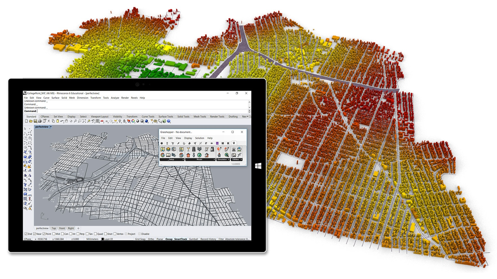
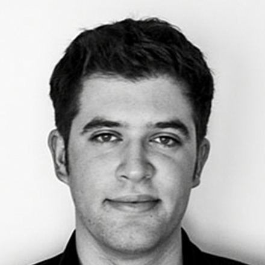
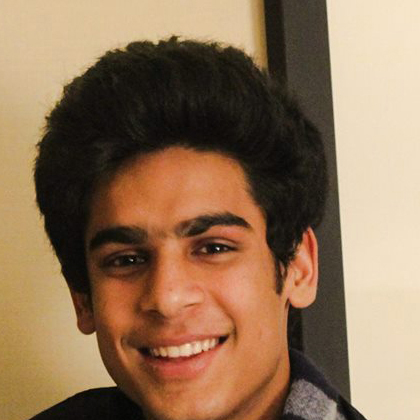
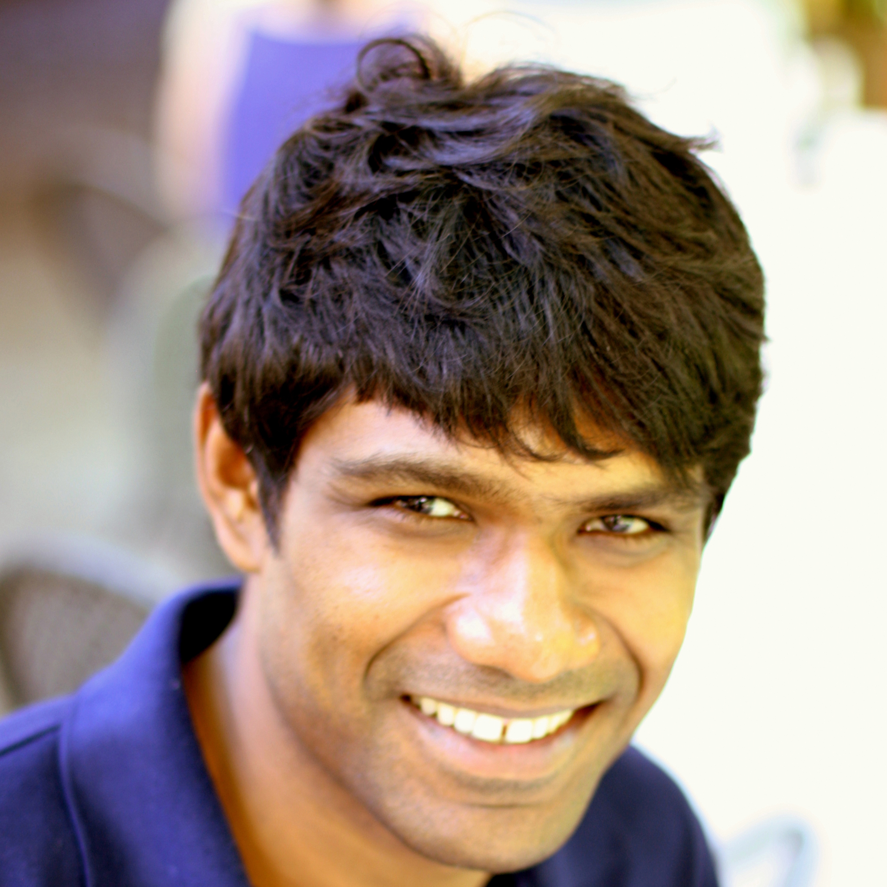
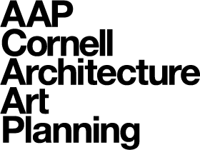

---
hide:
  - navigation
  - toc
---

# Urbano {.sr-only}

<figure markdown="span">
  { width="250" .skip-lightbox alt="" }
</figure>

  Site and mobility analysis in Rhino & Grasshopper. 

 

{.skip-lightbox}

[:material-rocket-launch: Get Started](https://docs.urbano.io/){ .md-button .md-button--primary }
[:material-download: Download V1](https://www.food4rhino.com/en/app/urbano){ .md-button target="_blank" rel="noopener noreferrer" aria-label="Download V1 (opens in a new tab)" }
[:material-download: Download V2](https://rhinopackages.github.io/?search=urbano&sort=2&p=Urbano2){ .md-button target="_blank" rel="noopener noreferrer" aria-label="Download V2 (opens in a new tab)" }

---

## 👥 Team

<figure class="mdx-users__testimonial black-and-white" tabindex="0" role="group" aria-label="Team member: Yang Yang">
    
    <figcaption class="md-typeset">Yang Yang</figcaption>
  </figure>
  
  <figure class="mdx-users__testimonial black-and-white" tabindex="0" role="group" aria-label="Team member: Patrick Kastner">
    
    <figcaption class="md-typeset">Patrick Kastner</figcaption>
  </figure>

<figure class="mdx-users__testimonial black-and-white" tabindex="0" role="group" aria-label="Team member: Timur Dogan">
    
    <figcaption class="md-typeset">Timur Dogan</figcaption>
  </figure>

## 👥 Alumni & Advisors

<figure class="mdx-users__testimonial black-and-white" tabindex="0" role="group" aria-label="Alumni and Advisor: Nikhil Saraf">
    
    <figcaption class="md-typeset">Nikhil Saraf</figcaption>
  </figure>

<figure class="mdx-users__testimonial black-and-white" tabindex="0" role="group" aria-label="Alumni and Advisor: Samitha Samaranayake">
    
    <figcaption class="md-typeset">Samitha Samaranayake
</figcaption>
  </figure>

---

{width="350" .skip-lightbox loading=lazy}
:octicons-plus-24: and 
{width="320" .skip-lightbox loading=lazy}

Urbano is being developed as a cross-disciplinary project through a collaboration between the Environmental Systems Lab at Cornell AAP, and the Systems Engineering department at Cornell Engineering.

---

## 🎉 Supporters

{width="150" .skip-lightbox loading=lazy .center} 
{ .card }

{width="125" .skip-lightbox loading=lazy .center} 
{ .card }

{width="325" .skip-lightbox loading=lazy .center}
{ .card }

