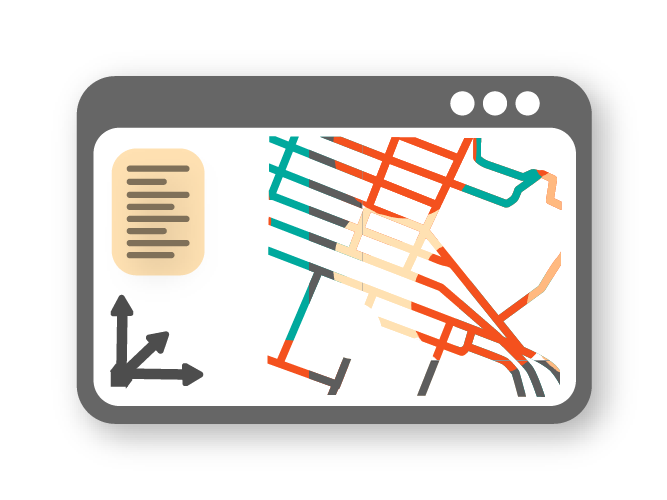
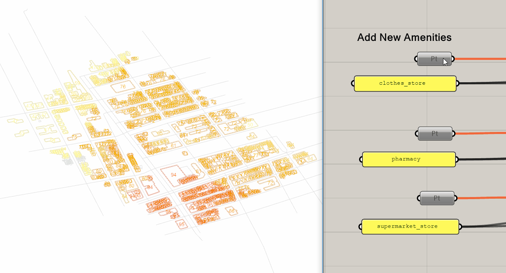

---
hide:
  - navigation
  - toc
---

<figure markdown="span">
  { width="250" .skip-lightbox }
</figure>

  Mobility modelling and simulation in Rhino & Grasshopper

 

{.skip-lightbox}

  <a href="https://docs.urbano.io/" class="md-button md-button--primary">Get Started</a>
  <a href="https://www.food4rhino.com/en/app/urbano" class="md-button">Download</a>

---

## 🚀 Features

A preview of what Urbano enables you to do

-   { width="240" loading=lazy .skip-lightbox .center }

    ---

    __DOWNLOAD GEOSPATIAL DATA__  

    Download maps and points-of-interest data from **OpenStreetMap** directly in Grasshopper.

-   { width="240" loading=lazy .skip-lightbox .center }

    ---

    __IMPORT & AGGREGATE DATA__  

    Parse and merge layers from OSM or shapefiles into a single coherent project model.

-   { width="240" loading=lazy .skip-lightbox .center }

    ---

    __LOOK-UP & MODIFY METADATA__  

    Attach, query and parametrically edit metadata on any geometric object.

-   { width="240" loading=lazy .skip-lightbox .center }

    ---

    __BUILD MOBILITY MODEL__  

    Auto-generate a topological street network and building access points ready for simulation.

-   { width="240" loading=lazy .skip-lightbox .center }

    ---

    __MULTI-MODAL ROUTING__  

    Compute fastest paths for pedestrians, cyclists or cars between origins and destinations.

-   { width="240" loading=lazy .skip-lightbox .center }

    ---

    __SIMULATE WITH TRIP ENGINE__  

    Launch activity-based simulations using Amenity Demand Profiles (ADP).

-   { width="240" loading=lazy .skip-lightbox .center }

    ---

    __ANALYSE AMENITIES & STREETS__  

    Evaluate Streetscore, Amenityscore and Walkscore to assess vitality and accessibility.

-   { width="240" loading=lazy .skip-lightbox .center }

    ---

    __INTEGRATED CAD WORKFLOW__  

    Bake geometry with metadata back to Rhino and visualise results instantly.

---

## 📊 Metrics

-   { width="260" loading=lazy .skip-lightbox .center }

    ---

    __AMENITY DEMAND PROFILE__  

    Spatiotemporal distribution of human activities; default data provided and fully editable.

-   { width="260" loading=lazy .skip-lightbox .center }

    ---

    __STREETSCORE__  

    Counts *Street Hits* to show how many simulated trips use each street segment.

-   { width="260" loading=lazy .skip-lightbox .center }

    ---

    __AMENITYSCORE__  

    Compares amenity demand (Amenity Hits) with supply to reveal over- or under-served areas.

-   { width="260" loading=lazy .skip-lightbox .center }

    ---

    __WALKSCORE__  

    Calculates a 0-100 walkability rating with customisable weightings.

---

## 🛠️ Samples

Use cases with Urbano components

-   { width="300" loading=lazy .skip-lightbox .center }

    ---

    __URBANO TEMPLATES__  

    *Import Urbano Template* – starter files that demonstrate each core workflow.

-   { width="300" loading=lazy .skip-lightbox .center }

    ---

    __ROUTING__  

    *Router* – compute shortest paths, distances and travel times for multiple traffic modes.

-   { width="300" loading=lazy .skip-lightbox .center }

    ---

    __ACCESSIBILITY WITHIN DISTANCE__  

    *Router* – visualise all buildings reachable from an origin within a chosen threshold.

-   { width="300" loading=lazy .skip-lightbox .center }

    ---

    __TRIPS FROM GIVEN ORIGIN__  

    *ADP Trip Engine & Inspect Trip* – split population by ADP and send trips to valid amenities.

-   { width="300" loading=lazy .skip-lightbox .center }

    ---

    __STREETSCORE (ADD LINK)__  

    *ADP Trip Engine & Street Hits* – add or remove links and see Street Hits update instantly.

-   { width="300" loading=lazy .skip-lightbox .center }

    ---

    __AMENITYSCORE (ADD POPULATION)__  

    *ADP Trip Engine & Amenity Hits* – add building occupants and observe nearby amenity utilisation.

-   { width="300" loading=lazy .skip-lightbox .center }

    ---

    __AMENITYSCORE (ADD AMENITIES)__  

    *ADP Trip Engine & Amenity Hits* – insert new amenities to balance supply and demand.

-   { width="300" loading=lazy .skip-lightbox .center }

    ---

    __AMENITYSCORE (ADP TIME STEPS)__  

    *ADP & Trip Engine* – run 24-hour simulations to capture temporal variations.

-   { width="300" loading=lazy .skip-lightbox .center }

    ---

    __WALKSCORE (ADD AMENITIES)__  

    *Trip Engine & Walkscore* – add missing amenities to improve walkability scores.

---

## 👥 Team

<figure class="mdx-users__testimonial black-and-white">
    
    <figcaption class="md-typeset">Yang Yang</figcaption>
  </figure>

<figure class="mdx-users__testimonial black-and-white">
    
    <figcaption class="md-typeset">Timur Dogan</figcaption>
  </figure>

## 👥 Alumni

<figure class="mdx-users__testimonial black-and-white">
    
    <figcaption class="md-typeset">Nikhil Saraf</figcaption>
  </figure>

<figure class="mdx-users__testimonial black-and-white">
    
    <figcaption class="md-typeset">Samitha Samaranayake
</figcaption>
  </figure>

---

{width="350" .skip-lightbox align=left loading=lazy}  
{width="320" .skip-lightbox align=right loading=lazy}

:octicons-plus-24:

   

Urbano is being developed as a cross-disciplinary project through a collaboration between the Environmental Systems Lab at Cornell AAP, and the Systems Engineering department at Cornell Engineering.

---

## 🎉 Supporters

{width="150" .skip-lightbox loading=lazy .center} 
{ .card }

{width="125" .skip-lightbox loading=lazy .center} 
{ .card }

{width="325" .skip-lightbox loading=lazy .center}
{ .card }

